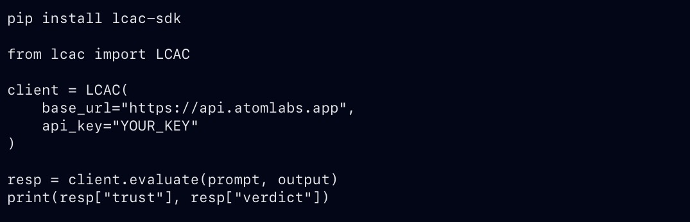

# LCAC Governor - Cognitive Integrity Framework  
**Atom Labs · 2025**

LCAC Governor is a **cognitive integrity layer** designed to sit *in front* of any LLM, agent, toolchain, or reasoning system.  
It does **not** replace your model.

It **governs** it.

LCAC continuously evaluates outputs for:
- Trust degradation  
- Drift variance  
- Cognitive instability  
- Reasoning anomalies  
- Multi-agent interference  
- Prompt-injection exploitation  
- Long-context decay  
- Hallucination risks  

It delivers:
- Real-time trust scoring (0 → 1)  
- Variance and drift detection  
- Metrics & telemetry dashboard  
- Keyed license + usage quota system  
- Stripe-backed tiering (Free → Starter → Pro → Enterprise)  
- Evaluation engine + SDK  
- Unified `/overview` cognitive snapshot  
- A complete SaaS-ready console UI  

Production endpoints:

```
API     → https://api.atomlabs.app  
Console → https://console.atomlabs.app/console  
```

---

# Why LCAC Exists

Modern LLMs fail **silently**.  
They drift without warning.  
They make confident errors.  
They degrade with context size.  
They cross reasoning boundaries under multi-agent orchestration.

Enter LCAC:

> **A cognitive governor that gives you visibility *before* things break - not after.**

LCAC identifies:
- Hidden instability  
- Drift vectors  
- Trust loss patterns  
- Adversarial prompt failures  
- Injection attempts  
- Unbounded tool execution  
- Reasoning shortcuts / collapse  

This is the visibility every enterprise wishes they had.

---

# High-Level Architecture

```mermaid
flowchart TD
  A[Client / LLM] --> B[LCAC Governor API]
  B --> C[Trust Engine]
  B --> D[Variance Analyzer]
  B --> E[Ledger & Hash Chain]
  C --> F[/overview Endpoint]
  D --> F
  E --> F
  F --> G[Console Dashboard]

---

# API Overview

The LCAC engine exposes the following endpoints:

| Method | Endpoint            | Description |
|--------|----------------------|-------------|
| `POST` | `/evaluate`         | Run cognitive integrity evaluation on prompt/output |
| `GET`  | `/overview`         | Unified snapshot of trust, drift, stability, persona, ledger |
| `GET`  | `/metrics`          | Time-series trust/variance telemetry |
| `GET`  | `/info`             | System health, uptime, CPU/mem, version, last license |
| `GET`  | `/license/verify`   | Validate and retrieve license metadata |

Full reference here:  
`docs/api-reference.md`

---

# Example - Evaluate a Prompt/Output

```json
POST /evaluate
{
  "prompt": "Explain quantum gravity to a child.",
  "output": "It is like magic glue in space."
}
```

**Response:**
```json
{
  "license": "trial_129ab3ac",
  "trace_id": "d511ede8-39cd-4694-8f48-32a65d36a91f",
  "trust": 0.612,
  "variance": 0.004,
  "verdict": "unstable",
  "reason": "Trust score derived from base=0.61 variance=0.004",
  "recommendation": "Cognitive drift detected. Reduce context overlap.",
  "severity": {
    "level": 3,
    "label": "critical"
  },
  "insight": "LCAC observed reasoning state 'UNSTABLE' at 2025-11-13T04:54Z — cognitive drift detected."
}
```

---

# `/overview` Unified Cognitive State

The `/overview` endpoint aggregates:

- Trust  
- Variance  
- Verdict  
- Insight  
- Recommendation  
- Active persona  
- Stability mode (HOLD / ELEVATE / LOCKDOWN)  
- Ledger count  
- Last reasoning summary  

Sample:

```json
{
  "trust": 0.598,
  "variance": 0.002,
  "verdict": "unstable",
  "mode": "HOLD",
  "persona": "default",
  "insight": "Monitoring cognitive drift.",
  "ledger_count": 59
}
```

---

# LCAC Console (SaaS Dashboard)


The LCAC dashboard delivers:

- Live heartbeat  
- Trust trend graph  
- Variance overlays  
- Reasoning insight streams  
- Governor mode indicator  
- License + quota usage  
- Test suite (hallucination / logic / injection / bias)  
- Stripe-backed tier system  
- Quick evaluation UI  

Located at:

```
https://console.atomlabs.app/console
```

---

# Licensing & Billing (Stripe)

LCAC includes a fully integrated license + billing engine.

### Tiers (default)
| Tier | Price | Tokens | Mode |
|------|--------|---------|--------|
| Starter | $19 | 5,000 evals | one-time |
| Pro | $79 | 25,000 evals/month | subscription |
| Enterprise | $999 | custom | subscription |

Stripe webhook automatically issues or adjusts licenses:

```
lcac:license:<email>
```

Example license entry:

```json
{
  "email": "user@example.com",
  "tier": "pro",
  "quota": 25000,
  "used": 141,
  "status": "active",
  "stripe_customer": "cus_ABC123"
}
```

---

# Python SDK



Available in `sdk/python`.

### Install (developer mode)
```
pip install -e ./sdk/python
```

### Usage
```python
from lcac import LCAC

governor = LCAC(license_key="trial_abc123")

result = governor.evaluate(
    prompt="Summarize the plot of Dune.",
    output="A boy becomes a space wizard."
)

print(result["verdict"], result["trust"])
```

SDK Supports:
- evaluate()
- overview()
- metrics()
- info()
- license_status()
- automatic license passing

---

# Repository Structure

```
lcac-governor/
│
├── api/                      # Core engine
│   ├── lcac_api.py
│   ├── lcac_console.html
│   ├── lcac_console_alias.py
│   ├── lcac_stripe_checkout.py
│   ├── lcac_stripe_hooks.py
│   └── lcac_landing.py
│
├── sdk/
│   └── python/
│       └── lcac/
│           ├── __init__.py
│           ├── client.py
│           └── models.py
│
├── docs/
│   ├── api-reference.md
│   ├── architecture.md
│   ├── governance-model.md
│   └── img/
│       ├── console.png
│       ├── header.png
│       └── sdk.png
│
├── examples/
│   ├── sdk_basic.py
│   ├── eval_batch.py
│   └── risk_analysis.py
│
└── README.md
```

---

# Security Model

LCAC is built around three layers:

## 1. **Cognitive Integrity Layer**
- Trust scoring  
- Variance analysis  
- Verdict mapping  
- Drift detection  
- Persona awareness  

## 2. **Execution Governance Layer**
- Mode switching: HOLD → ELEVATE → LOCKDOWN  
- Hash-chained ledger  
- Last-verdict reflection  
- Insight recommendations  

## 3. **Access Control Layer**
- License keys  
- Quota enforcement  
- Stripe customer linking  
- Redis-backed usage tracking  

---

# Roadmap

- [x] API v1  
- [x] Console UI  
- [x] Stripe billing  
- [x] Python SDK  
- [x] Landing page  
- [ ] JS SDK  
- [ ] Go SDK  
- [ ] Enterprise multi-LLM adapters  
- [ ] Admin dashboard  
- [ ] CI test suite  

---

# License

MIT - see `LICENSE`.

---

# Support

This framework is under active heavy development.  
For enterprise licensing or partnership inquiries:

```
lcac@atomlabs.app
```
